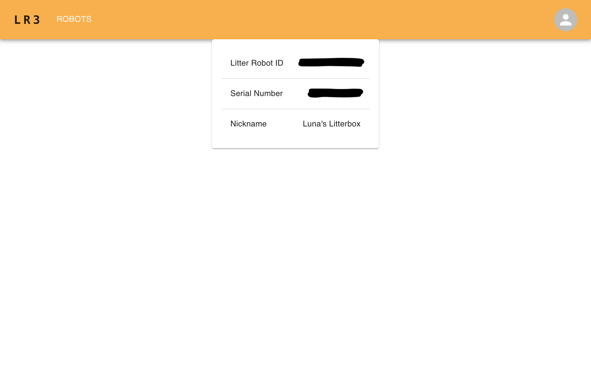
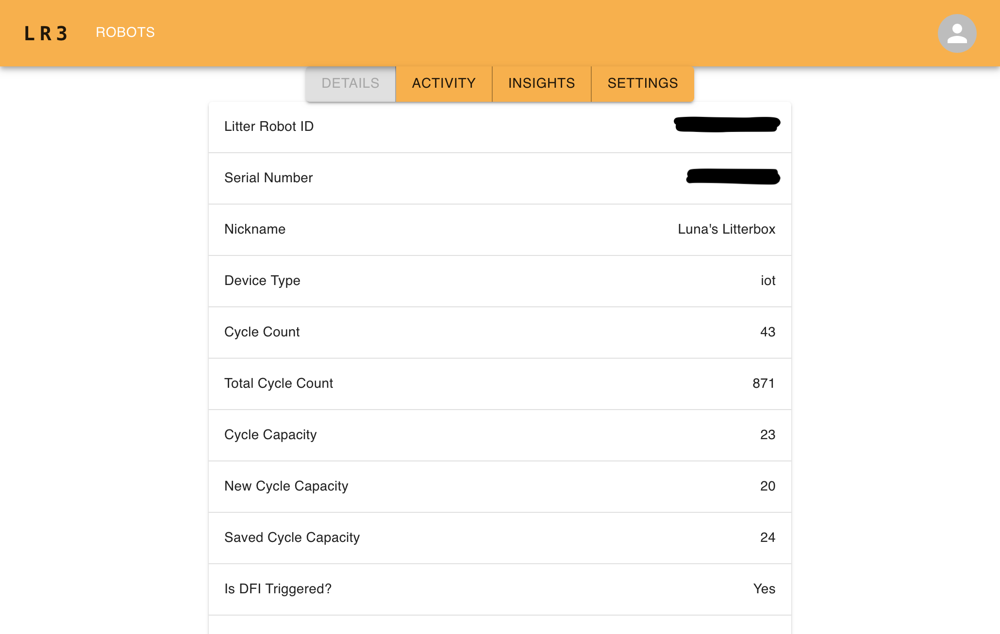
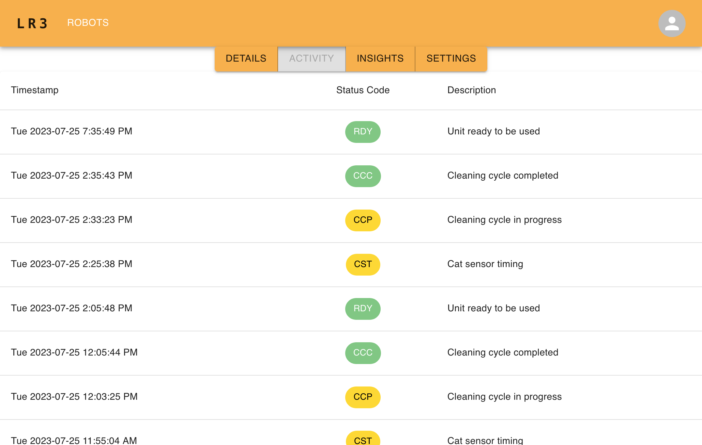
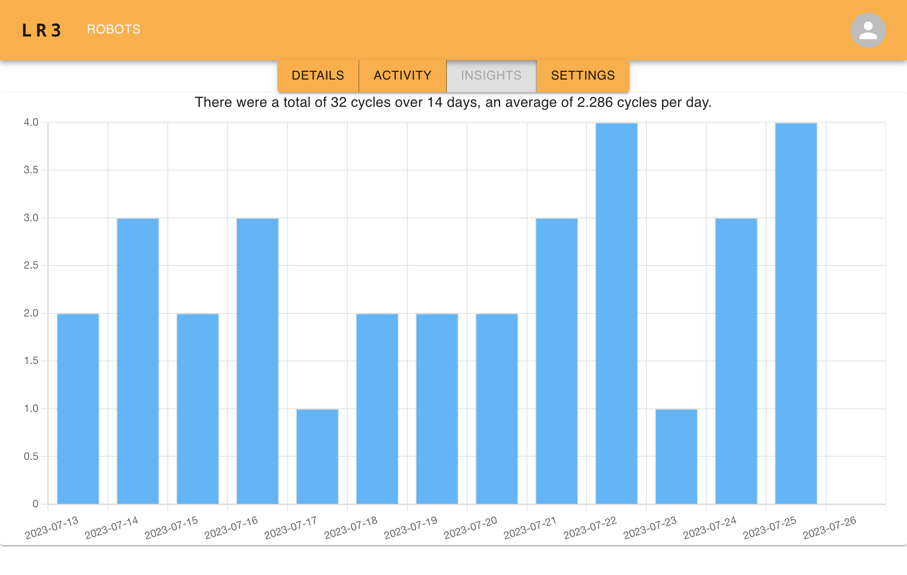
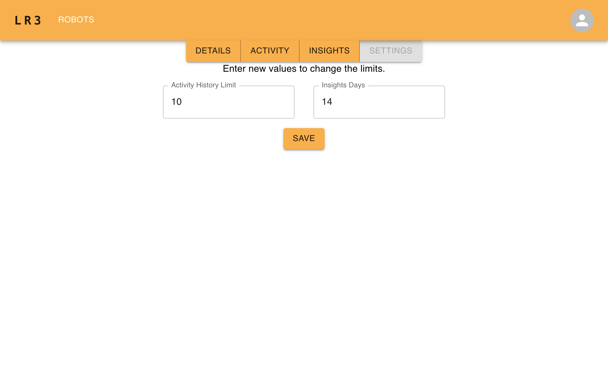
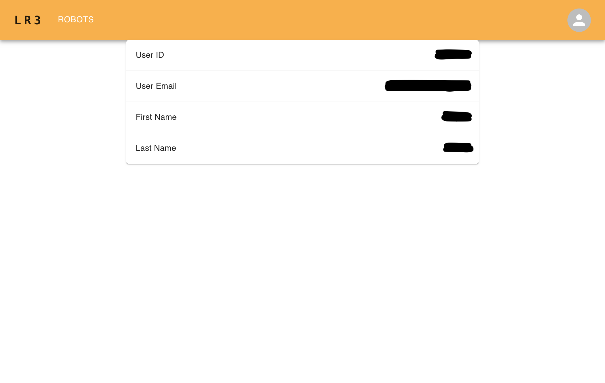
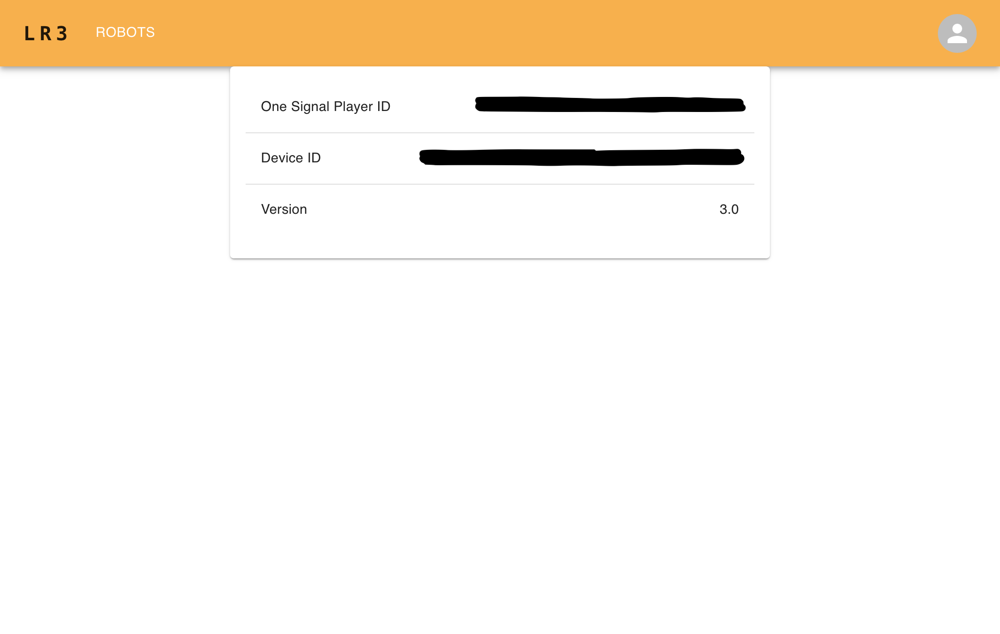
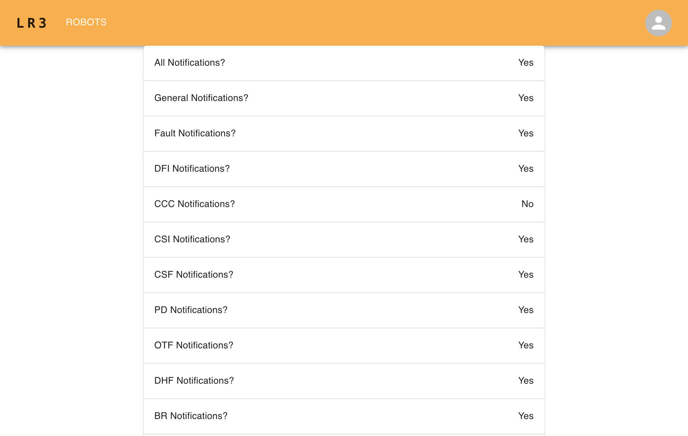

# Litter Robot 3 Web App

Whisker has applications for mobile phones, but does not currently offer a browser-based portal for customers. This Spring Boot app aims to be that portal for Litter Robot 3. Run this on a trusted local network to check your Litter Robot 3 activity from a browser.

## Tools Used
- [Spring Boot](https://spring.io/projects/spring-boot)
- Whisker's Litter Robot 3 API
- [Create React App](https://github.com/facebook/create-react-app)
- [Material UI](https://mui.com)
- [Chart.js](https://www.chartjs.org) (using [react-chartjs-2](https://reactchartjs.github.io/react-chartjs-2))

# Getting Started

To start up the application, you need to provide your Whisker credentials and some extra info. The server is currently setup to run on port 8080:

```
java -jar \
-DLITTER_ROBOT_USER=whisker-user@example.com \
-DLITTER_ROBOT_PASSWORD=whisker-password \
-DCLIENT_ID=whisker-client-id \
-DCLIENT_SECRET=whisker-client-secret \
-DAPI_KEY=whisker-api-key \
LitterRobot3WebApp-0.1.1.jar
```

- `LITTER_ROBOT_USER` is your Whisker account email.
- `LITTER_ROBOT_PASSWORD` is your Whisker account password.
- I found values for `CLIENT_ID`, `CLIENT_SECRET`, & `API_KEY` in the following projects:
  - [joshjcarrier/homeassistant-litter-robot](https://github.com/joshjcarrier/homeassistant-litter-robot/blob/master/custom_components/litter_robot/litter_robot.py#L100-L101)
  - [tlkamp/litter-exporter](https://github.com/tlkamp/litter-exporter/blob/main/main.go#L18-L20)
  - [ryanleesmith/homebridge-litter-robot-connect](https://github.com/ryanleesmith/homebridge-litter-robot-connect/blob/master/lib/litter-robot-connect.js#L9-L10)
  - [mikeleo/homebridge-litter-robot](https://github.com/mikeleo/homebridge-litter-robot/blob/master/src/lib/litter-robot/index.ts#L92-L94)
  - [constructorfleet/HomeAssistant-Component-LitterRobot](https://github.com/constructorfleet/HomeAssistant-Component-LitterRobot/blob/master/__init__.py#L76-L77)
  - [dcmeglio/hubitat-litterrobot](https://github.com/dcmeglio/hubitat-litterrobot/blob/master/smartapps/natekspencer/litter-robot-manager.src/litter-robot-manager.groovy#L46-L48)
  - [hexfusion/homeassistant-litter-robot](https://github.com/hexfusion/homeassistant-litter-robot/blob/master/custom_components/litter_robot/litter_robot.py#L100-L101)
  - [mannkind/litterrobot2mqtt](https://github.com/mannkind/litterrobot2mqtt/blob/main/LitterRobot/DataAccess/SourceDAO.cs#L398-L400)
  - [natekspencer/LitterRobotManager](https://github.com/natekspencer/LitterRobotManager/blob/master/smartapps/natekspencer/litter-robot-manager.src/litter-robot-manager.groovy#L121-L122)

---
## Sample Screenshots








